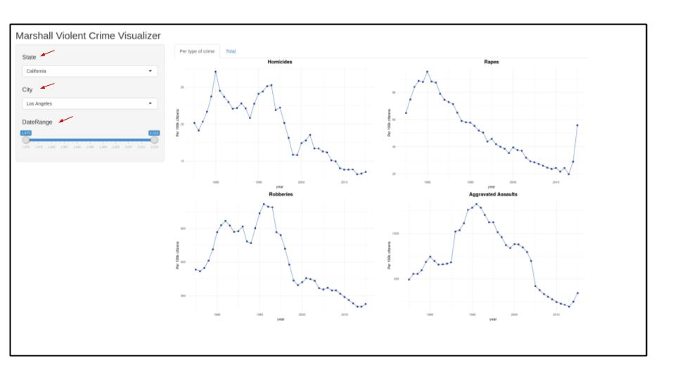

## Milestone Write-up

### Rationale

The app’s target users are public leaders who are very busy and usually
not analitically trained. For this reason, we chose to be parsimonious
with the filter options we wanted to offer. We chose three:

  - State
  - City
  - Year range

With these filters the user can answer the most relevant questions, such
as:

  - Is crime increasing in my city?
  - How does my city compare with other nearby cities?
  - How does my city compare with the state average?
  - How does my city compare with the national average?

Also, to improve the user experience, we implemented a self-updating
drop-down list: the cities that show up as options in the filter are
only the ones who belong to the chosen state:

Furthermore, we decided to break down the crime numbers into different
types of agression (rape, homicide, robbery and aggravated assault). The
reason for that is that not only is it insightful to see different types
of crime separetely, but also the scales are very different and lumping
them all together would probably hide nuances about the phenomenon.
Moreover, since the data is a clear time-series, line plot is the best
choice of geometry - columns ended up too cluttered and we really wanted
to emphasize the trend over time over the absolute value of the
indicator.

Still, since we know politicians quite often want simplicity and
elegance over analytical accuracy, we created a new tab for the
aggregated data, now in a bar chart version. We thought it would be good
to give a new perspective on the data, and we also have extra space in
the new tab:

### Tasks

In this milestone we completed the following tasks:

  - [Data Cleaning](script_clean_data.R)
  - Development of a first functional version of the app, fulfilling our
    proposal [plan](README.md). The main features were:
      - Filters for state, city and year
      - Dynamic data wrangling, according to the filters
      - Self-updating drop-down list for cities
      - Parametric graph generation using ggplot (only one graph
        declaration used for multiple crime types)
      - Separate tabe for aggregated data
  - Deployment to the
    [cloud](https://olivia-lin.shinyapps.io/crime_visualizer/), using
    shinyapp.io.

### Vision and Next Steps

We have three main goals for next week:

  - Bug correction, as per next topic.
  - Graph aesthetics improvements: choice of colors, line width, shape
    of markers, background color, transparency, axis, grids, labels.
  - App aesthetic improvements: headers and containers for different
    sections of the app.

As a “nice-to-have” feature, we are considering including a map of the
crimes as per the users location of choice.

### Bugs

The app ran with no problem in our local environment, but when
publishing to the cloud the graphs disappear when choosing “States: All,
City: All”. We could not reproduce the error locally and will have to
debug it next week.

